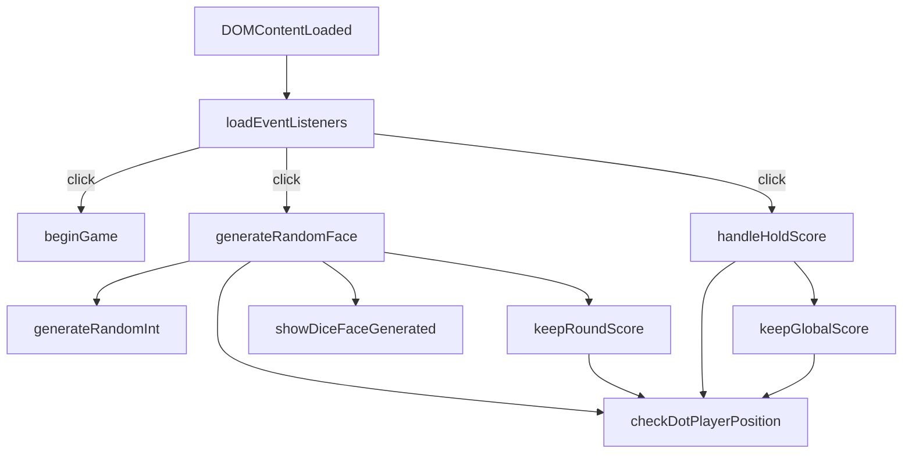

All game logic lives in `js/script.js`, wrapped in a single `DOMContentLoaded` listener. The file is approximately 270 lines and exports no modules — every function is a named function declaration in the same closure scope.

## Initialization

The entire script is wrapped in a `DOMContentLoaded` event listener:

```javascript
document.addEventListener("DOMContentLoaded", () => {
  // all selectors, state, and functions defined here
});
```

This ensures that every `querySelector` call runs after the HTML has been fully parsed. If the script were placed in `<head>` without this wrapper (or without a `defer` attribute), all DOM queries would return `null` and the game would silently fail.

`loadEventListeners()` is called immediately after all variable declarations, wiring up the three action buttons before any user interaction can occur.

## State management

The only piece of mutable module-level state is `randomNumber`:

```javascript
let randomNumber;
```

This variable is declared in the outer closure (not inside any function) so it is readable by both `keepRoundScore()` and `showDiceFaceGenerated()` after `generateRandomFace()` assigns it. It has no default value — reading it before the first roll returns `undefined`, which is why all score logic is gated behind an active player check.

<Note>
  `randomNumber` is reassigned on every call to `generateRandomFace()`. There is no history of past rolls — only the most recent value is available to other functions.
</Note>

## Turn indicator

The turn indicator is a single FontAwesome circle icon created once at startup:

```javascript
const dotPlayer = document.createElement("i");
dotPlayer.classList.add("fa-solid", "fa-circle");
dotPlayer.style.color = "#eb4d4c";
dotPlayer.style.margin = "calc(clamp(27%, 15vw, 50px) / 4)";
```

Because `dotPlayer` is a real DOM node, `Element.append()` **moves** it rather than copying it — a DOM node can only have one parent at a time. Appending `dotPlayer` to `player2` automatically removes it from `player1`. This single-node approach is what makes `checkDotPlayerPosition()` reliable: the element's current parent always reflects the active player with no additional state to synchronize.

<Tip>
  Calling `player2.append(dotPlayer)` when `dotPlayer` is already a child of `player2` is a no-op — the node stays where it is and no error is thrown.
</Tip>

## Functions

<AccordionGroup>
  <Accordion title="loadEventListeners()">
    Wires up the three click handlers. Called once immediately after variable declarations, before any user interaction.

    ```javascript
    function loadEventListeners() {
      startGame.addEventListener("click", beginGame);
      rollDice.addEventListener("click", generateRandomFace);
      holdScore.addEventListener("click", handleHoldScore);
    }
    ```

    **Parameters:** none

    **Returns:** `undefined`

    **Side effects:** Registers three `click` listeners on `#startGame`, `#rollDice`, and `#holdScore`.
  </Accordion>

  <Accordion title="beginGame()">
    Resets the game to its initial state. Called when the user clicks **NEW GAME**.

    ```javascript
    function beginGame() {
      globalScore1.textContent = "0";
      globalScore2.textContent = "0";
      currentScore1.textContent = "0";
      currentScore2.textContent = "0";
      player1.append(dotPlayer);
    }
    ```

    **Parameters:** none

    **Returns:** `undefined`

    **Side effects:**
    - Sets `#GS1`, `#GS2`, `#CS1`, and `#CS2` `textContent` to `"0"`.
    - Appends `dotPlayer` to `#player1Title`, making Player 1 the active player and visually moving the indicator away from Player 2 if it was there.

    <Warning>
      Clicking **ROLL DICE** or **HOLD** before clicking **NEW GAME** results in `checkDotPlayerPosition()` returning `"none"`, so neither button performs any action. Always start a new game first.
    </Warning>
  </Accordion>

  <Accordion title="generateRandomFace()">
    The handler for the **ROLL DICE** button. Generates a new random number, updates the active player's current score, and re-renders the dice face.

    ```javascript
    function generateRandomFace() {
      randomNumber = generateRandomInt(1, 7);
      const currentPlayer = checkDotPlayerPosition();
      if (currentPlayer === "player1") keepRoundScore(currentScore1);
      else if (currentPlayer === "player2") keepRoundScore(currentScore2);
      showDiceFaceGenerated();
    }
    ```

    **Parameters:** none

    **Returns:** `undefined`

    **Side effects:**
    - Writes to the module-level `randomNumber` variable.
    - Calls `keepRoundScore()` with the correct score element for the active player.
    - Calls `showDiceFaceGenerated()` to update the 9 dot elements.
    - If no player is active (`"none"`), only `showDiceFaceGenerated()` runs — the score is not updated.
  </Accordion>

  <Accordion title="generateRandomInt(min, max)">
    Returns a random integer in the range **[min, max)** — inclusive of `min`, exclusive of `max`. Follows the standard [MDN pattern](https://developer.mozilla.org/en-US/docs/Web/JavaScript/Reference/Global_Objects/Math/random#getting_a_random_integer_between_two_values).

    ```javascript
    function generateRandomInt(min = 0, max = 6) {
      min = Math.ceil(min);
      max = Math.floor(max);
      return Math.floor(Math.random() * (max - min)) + min;
    }
    ```

    **Parameters:**
    - `min` (`number`, default `0`) — Lower bound, inclusive. Ceiled to the nearest integer.
    - `max` (`number`, default `6`) — Upper bound, exclusive. Floored to the nearest integer.

    **Returns:** `number` — A random integer where `min <= result < max`.

    **Side effects:** None.

    When called from `generateRandomFace()`, the arguments are `1` and `7`, producing a result in `{1, 2, 3, 4, 5, 6}` — the six faces of a standard die.

    <Info>
      The default arguments (`0` and `6`) are never used in practice. `generateRandomFace()` always passes explicit values of `1` and `7`.
    </Info>
  </Accordion>

  <Accordion title="showDiceFaceGenerated()">
    Renders the current `randomNumber` as a dot pattern on the dice face. Iterates all 9 `.dot` elements, resets each to white, then selectively highlights specific indices in `#eb4d4c`.

    ```javascript
    function showDiceFaceGenerated() {
      dotElements.forEach((dot, index) => {
        dot.style.color = "#fff";
        switch (randomNumber) {
          case 1:
            if (index === 4) dot.style.color = "#eb4d4c";
            break;
          case 2:
            if (index === 0 || index === 8) dot.style.color = "#eb4d4c";
            break;
          case 3:
            if (index === 0 || index === 4 || index === 8) dot.style.color = "#eb4d4c";
            break;
          case 4:
            if (index === 0 || index === 2 || index === 6 || index === 8) dot.style.color = "#eb4d4c";
            break;
          case 5:
            if (index === 0 || index === 2 || index === 4 || index === 6 || index === 8) dot.style.color = "#eb4d4c";
            break;
          case 6:
            if (index === 0 || index === 1 || index === 2 || index === 6 || index === 7 || index === 8)
              dot.style.color = "#eb4d4c";
            break;
        }
      });
    }
    ```

    **Parameters:** none (reads module-level `randomNumber`)

    **Returns:** `undefined`

    **Side effects:** Mutates the `style.color` of all 9 `.dot` elements.

    The 9 dots are arranged in a 3×3 grid. Their indices map to physical positions as follows:

    | Index | Position      |
    |-------|---------------|
    | 0     | Top-left      |
    | 1     | Top-center    |
    | 2     | Top-right     |
    | 3     | Middle-left   |
    | 4     | Center        |
    | 5     | Middle-right  |
    | 6     | Bottom-left   |
    | 7     | Bottom-center |
    | 8     | Bottom-right  |

    Active (red) indices per face value:

    | Face | Active indices         | Pattern description           |
    |------|------------------------|-------------------------------|
    | 1    | 4                      | Single center dot             |
    | 2    | 0, 8                   | Top-left and bottom-right     |
    | 3    | 0, 4, 8                | Diagonal                      |
    | 4    | 0, 2, 6, 8             | Four corners                  |
    | 5    | 0, 2, 4, 6, 8          | Four corners plus center      |
    | 6    | 0, 1, 2, 6, 7, 8       | Top row and bottom row        |
  </Accordion>

  <Accordion title="keepRoundScore(cs)">
    Adds `randomNumber` to the active player's current score element. If the roll was a 1, resets the score to `"0"` and passes the turn to the opponent instead.

    ```javascript
    function keepRoundScore(cs) {
      let roundScore = parseInt(cs.textContent) + randomNumber;
      const currentPlayer = checkDotPlayerPosition();
      if (currentPlayer === "player1" && randomNumber === 1) {
        cs.textContent = "0";
        player2.append(dotPlayer);
        return 0;
      }
      if (currentPlayer === "player2" && randomNumber === 1) {
        cs.textContent = "0";
        player1.append(dotPlayer);
        return 0;
      }
      cs.textContent = roundScore;
      return roundScore;
    }
    ```

    **Parameters:**
    - `cs` (`HTMLElement`) — The current score element to update. Either `#CS1` or `#CS2`.

    **Returns:** `number` — The new round score, or `0` if the roll was a 1.

    **Side effects:**
    - Mutates `cs.textContent`.
    - When `randomNumber === 1`: moves `dotPlayer` to the opponent's title element, ending the turn.

    <Note>
      `roundScore` is computed before the roll-of-1 check. The computed value is discarded in the penalty branch — `cs.textContent` is set to `"0"` directly rather than to `roundScore`.
    </Note>
  </Accordion>

  <Accordion title="keepGlobalScore(cs, gs, player)">
    Banks the active player's current score into their global total, resets their current score, moves the turn indicator to the next player, and checks for a win.

    ```javascript
    function keepGlobalScore(cs, gs, player) {
      let mainScore = parseInt(cs.textContent) + parseInt(gs.textContent);
      gs.textContent = mainScore;
      cs.textContent = 0;
      player.append(dotPlayer);
      const currentPlayer = checkDotPlayerPosition();
      if (currentPlayer === "player2" && mainScore >= 100) {
        alert(`player 1 you win!`);
        location.reload();
      } else if (currentPlayer === "player1" && mainScore >= 100) {
        alert(`player 2 you win!`);
        location.reload();
      }
    }
    ```

    **Parameters:**
    - `cs` (`HTMLElement`) — The current score element for the player who just held. Either `#CS1` or `#CS2`.
    - `gs` (`HTMLElement`) — The global score element for the player who just held. Either `#GS1` or `#GS2`.
    - `player` (`HTMLElement`) — The **opponent's** title element. `dotPlayer` is appended here to pass the turn.

    **Returns:** `undefined`

    **Side effects:**
    - Writes the new combined total to `gs.textContent`.
    - Resets `cs.textContent` to `0`.
    - Appends `dotPlayer` to `player` (the opponent), passing the turn.
    - If `mainScore >= 100`: calls `alert()` with the winner's name, then calls `location.reload()` to reset the page.

    <Warning>
      The win check reads `checkDotPlayerPosition()` **after** `dotPlayer` has already been moved to the opponent. This means the `"player2"` branch fires when Player 1 just won (because `dotPlayer` is now on Player 2), and vice versa. The alert text is correct — the logic is intentionally inverted.
    </Warning>
  </Accordion>

  <Accordion title="checkDotPlayerPosition()">
    Determines which player is currently active by checking which title element contains `dotPlayer`.

    ```javascript
    function checkDotPlayerPosition() {
      if (player1.contains(dotPlayer)) return "player1";
      else if (player2.contains(dotPlayer)) return "player2";
      else return "none";
    }
    ```

    **Parameters:** none

    **Returns:** `"player1"` | `"player2"` | `"none"`
    - `"player1"` — `dotPlayer` is a descendant of `#player1Title`.
    - `"player2"` — `dotPlayer` is a descendant of `#player2Title`.
    - `"none"` — `dotPlayer` has not been appended yet (before the first **NEW GAME** click).

    **Side effects:** None.
  </Accordion>

  <Accordion title="handleHoldScore()">
    The handler for the **HOLD** button. Identifies the active player and calls `keepGlobalScore()` with the correct score elements and the opponent's title element.

    ```javascript
    function handleHoldScore() {
      const currentPlayer = checkDotPlayerPosition();
      if (currentPlayer === "player1") keepGlobalScore(currentScore1, globalScore1, player2);
      else if (currentPlayer === "player2") keepGlobalScore(currentScore2, globalScore2, player1);
    }
    ```

    **Parameters:** none

    **Returns:** `undefined`

    **Side effects:** Delegates entirely to `keepGlobalScore()`. If no player is active (`"none"`), nothing happens.
  </Accordion>
</AccordionGroup>

## Call graph

The following diagram shows how the three button handlers relate to the rest of the functions:


